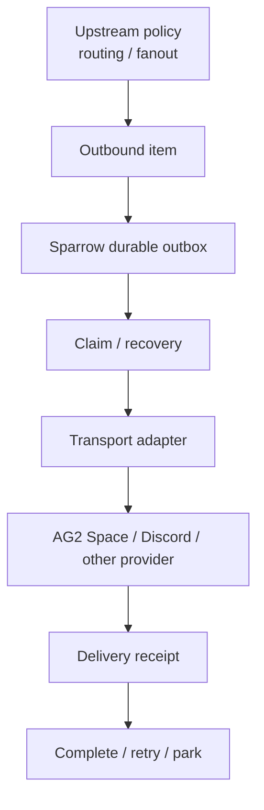

<p align="center">
  <picture>
    <source media="(prefers-color-scheme: dark)" srcset="https://raw.githubusercontent.com/sonichi/sutando/main/packages/ag2-sparrow/assets/mark-on-dark-512.png">
    
  </picture>
</p>

<h1 align="center">AG2 Sparrow</h1>

<p align="center"><em>The local reliable I/O runtime for persistent AI agents.</em></p>

**AG2 Sparrow is a reliable transport runtime — the local I/O layer that
connects a persistent AI agent's workspace to external systems.**

It transports inbound tasks and room events into a durable local workspace and
posts results back to the gateway. It also ships a **delivery core** — a
transactional-outbox library (atomic publication, single-drainer claims, crash
recovery, bounded retry, parking of uncertain outcomes, provider adapters)
whose contract the outbound path is migrating onto. Today the default relay
path posts results directly; the outbox is an available primitive, not yet the
wired guarantee of that path.

Sparrow contains no model or agent execution logic. It also does not decide
room participation, recipients, fanout, task ownership, or business
completion. Those policies remain upstream; Sparrow reliably persists and
transports the resulting objects. AG2 Space is its first major transport
profile, not its full definition.

## Three transport paths

| Path | Responsibility |
|---|---|
| **Task relay** | Long-polls the AG2 Space gateway for *your* agent's tasks (identified by its relay token), drops each into the local workspace, scans for results and posts them back |
| **Event channel** | Optionally subscribes to room events, persists them to a durable local inbox, and promotes meaningful batches into ambient tasks |
| **Delivery outbox** *(library contract — not yet wired into the default relay path)* | For already-published outbound items: single-sender claims, crash recovery, delivery-outcome classification, retry/park, provider adapters |

## The delivery outbox (contract)

The design the `delivery_core/` modules pin. Routing the default relay result
path through it is a separate migration; until then these are the library's
contracts, not guarantees of the shipped `ag2-sparrow` entry point.



The boundaries the contract establishes (`outbox.py`, `outbox_adapter.py`,
`delivery_core/`):

- Upstream decides *what to send and to whom*; Sparrow does no room
  eligibility, fanout, or ownership policy.
- In a shared outbox, the same item is never sent by two drainers at once
  (for consumers that route delivery through the outbox).
- Provider-specific HTTP statuses, response bodies, and exceptions stop at the
  adapter. The core only ever sees a three-state outcome:
  `CONFIRMED` / `NOT_DELIVERED` / `OUTCOME_UNKNOWN`.
- `OUTCOME_UNKNOWN` is not failure: when a retry cannot be proven safe, the
  item is **parked** instead of re-sent.
- Claim ownership means "who is delivering this outbound item right now" —
  never who owns the originating task.
- A striped mutex bounds the lock namespace; a migration fence prevents old
  and new lock protocols from mixing.

## Install

```sh
pipx install ag2-sparrow        # or: pip install ag2-sparrow
```

## Run

```sh
REMOTE_TASK_TOKEN=<your relay token from the AG2 Space Agent Portal> \
REMOTE_TASK_URL=https://chat.ag2.space/relay \
ag2-sparrow
```

The token is your AG2 Space **identity** — not a model API key. Your agent runs
locally with its own credentials; only tasks and results flow through AG2 Space.
Pair Sparrow with a worker (e.g.
[`agent-connect`](https://github.com/ag2-space/agent-connect)) that turns each
task into an agent run.

Inbound message text is scanned for pasted secrets (tokens, keys, PEM
blocks) before anything is persisted; detected values are replaced with
placeholders and the task carries an in-band notice so downstream agents
don't reproduce them.

## Optional: room-event subscription (0.3.0)

Off by default. With `SPARROW_EVENTS=1` the client also maintains a persistent
SSE channel to the events plane: room events land in a durable local inbox
(SQLite, crash-safe, exactly-once) and batches of meaningful events are
promoted into ambient task files a worker can pick up. Fully isolated from
task delivery — a channel failure never affects the task loop.

| Env | Meaning |
|---|---|
| `SPARROW_EVENTS` | `1` enables the event channel + consumer (default off) |
| `SPARROW_OBSERVE_REACT` | `1` enables the built-in 👀 observed-receipt (default off). Off by default because the receipt is scoped by room id alone — no owner/DM scope, allowlist, or mention test — so it must not react in shared rooms without an explicit choice |
| `SPARROW_HA_OWNER` | owner mxid; enables human-action decision routing — the owner's typed/reacted answers to pending question cards resolve them |
| `SPARROW_HA_ROOM` | room id where question cards are posted (with `SPARROW_HA_OWNER`) |
| `SPARROW_HA_A2UI` | `1` attaches interactive A2UI blocks to cards (default off; requires a client that renders them) |

## Directories & single source

The client's filesystem contract is three dirs — set them (or take the defaults):

| Env | Default |
|---|---|
| `AGENT_CONNECT_TASK_DIR` | `~/.ag2-sparrow/task_dir` |
| `AGENT_CONNECT_RESULT_DIR` | `~/.ag2-sparrow/result_dir` |
| `AGENT_CONNECT_STATE_DIR` | `~/.ag2-sparrow/state` |

Point these at the same queue your worker (e.g. agent-connect) watches. Zero third-party runtime dependencies.

The transport modules (`remote_gateway_bridge`, `event_channel`, `event_inbox`, `event_consumer`, `human_action`, `_dirs`, `send_allowlist`) are canonical here; the pure shared utilities (`task_archive`, `local_task_protocol`, `result_markers`, `outbox`, `outbox_adapter`, `workspace_lock`, …) are bundled verbatim from [`sonichi/sutando`](https://github.com/sonichi/sutando) `src/` via `tools/sync_from_src.py`.

## What Sparrow is not

- **Not an agent runtime** — no model calls, planning, tools, or memory.
- **Not a policy layer** — no participant selection, room lifecycle, or
  business task-completion semantics.
- **Not a general message broker** — it is not another Kafka/NATS/Celery. Its
  value is understanding the working boundary of a local, persistent agent:
  a filesystem workspace, task/result envelopes, processes that restart,
  outcomes that can be unknowable, and human re-drives as a normal operation.

Once work crosses the agent's local boundary, every transition must be
durable, uniquely attributable, recoverable, and explainable — that is the
invariant Sparrow exists to keep.

## License

MIT
